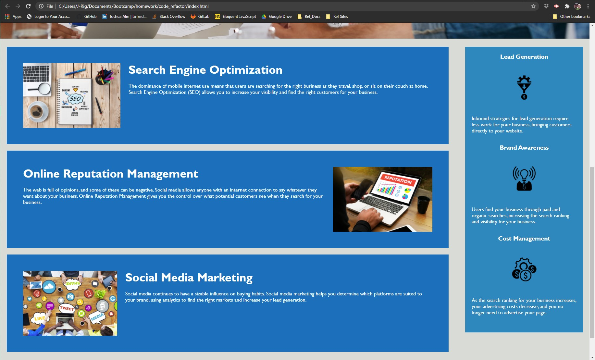

# code_refactor
Bootcamp - Homework Week 1 - Horiseon Webpage Code Refactor.

## Acceptance Criteria

* It's done WHEN I view the source code, THEN I find semantic HTML elements.

* It's done WHEN I view the structure of the HTML elements, THEN I find that the elements follow a logical structure independent of styling and positioning.

* It's done WHEN I view the image elements, THEN I find accessible alt attributes.

* It's done WHEN I view the heading attributes, THEN they fall in sequential order.

* It's done WHEN I view the title element, THEN I find a concise, descriptive title.

## Link
* <https://jmalm79.github.io/code_refactor/>   